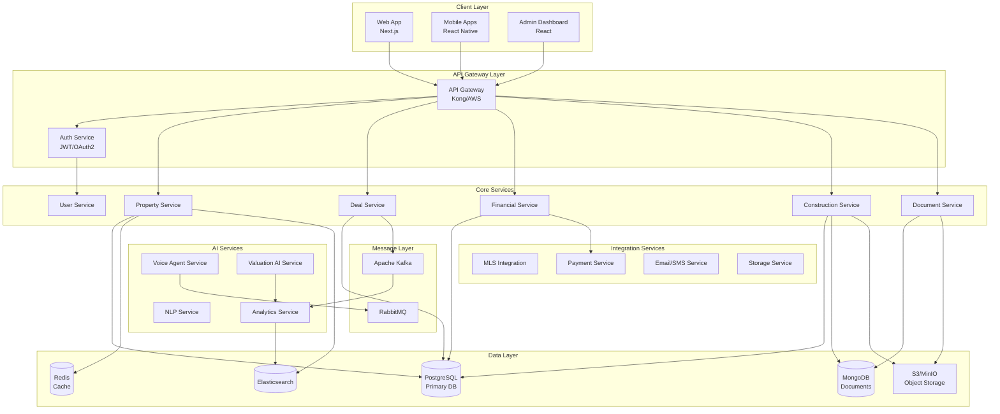

# Microservices Architecture - Real Estate Investment Platform

## Architecture Overview

This document provides detailed architectural diagrams and service definitions for the real estate investment platform's microservices architecture.

## System Architecture Diagram



## Service Communication Patterns

### Synchronous Communication
- REST APIs for client-service communication
- gRPC for inter-service communication
- GraphQL for complex data queries

### Asynchronous Communication
- Event-driven architecture using Kafka
- Task queues with RabbitMQ
- WebSockets for real-time updates

## Service Definitions

### 1. Property Service
```yaml
service: property-service
port: 3001
dependencies:
  - postgresql
  - redis
  - elasticsearch
endpoints:
  - GET /properties
  - GET /properties/:id
  - POST /properties
  - PUT /properties/:id
  - DELETE /properties/:id
  - POST /properties/search
  - GET /properties/:id/comps
  - GET /properties/:id/valuation
events:
  publishes:
    - property.created
    - property.updated
    - property.deleted
  subscribes:
    - valuation.completed
    - market.data.updated
```

### 2. Deal Service
```yaml
service: deal-service
port: 3002
dependencies:
  - postgresql
  - kafka
endpoints:
  - GET /deals
  - GET /deals/:id
  - POST /deals
  - PUT /deals/:id
  - POST /deals/:id/offers
  - PUT /deals/:id/status
  - GET /deals/:id/timeline
events:
  publishes:
    - deal.created
    - deal.status.changed
    - offer.received
  subscribes:
    - property.created
    - document.generated
    - payment.completed
```

### 3. Financial Service
```yaml
service: financial-service
port: 3003
dependencies:
  - postgresql
  - redis
endpoints:
  - GET /transactions
  - POST /transactions
  - GET /reports/pnl
  - GET /reports/cashflow
  - POST /budgets
  - GET /projections/:dealId
  - POST /expenses
events:
  publishes:
    - transaction.created
    - budget.exceeded
    - payment.processed
  subscribes:
    - deal.created
    - construction.expense.added
```

### 4. Construction Service
```yaml
service: construction-service
port: 3004
dependencies:
  - postgresql
  - mongodb
  - s3
endpoints:
  - GET /projects
  - POST /projects
  - GET /contractors
  - POST /contractors
  - POST /projects/:id/bids
  - POST /projects/:id/tasks
  - POST /projects/:id/photos
  - GET /projects/:id/progress
events:
  publishes:
    - project.created
    - bid.received
    - task.completed
    - milestone.reached
  subscribes:
    - deal.created
    - contractor.responded
    - inspection.completed
```

### 5. Voice Agent Service
```yaml
service: voice-agent-service
port: 3005
dependencies:
  - redis
  - rabbitmq
  - twilio
  - openai
endpoints:
  - POST /calls/initiate
  - GET /calls/:id/transcript
  - POST /calls/schedule
  - GET /agents/availability
events:
  publishes:
    - call.completed
    - appointment.scheduled
    - action.items.created
  subscribes:
    - contractor.call.requested
    - lead.qualification.needed
```

### 6. Valuation AI Service
```yaml
service: valuation-ai-service
port: 3006
dependencies:
  - postgresql
  - tensorflow
  - redis
endpoints:
  - POST /valuations/calculate
  - GET /valuations/:propertyId
  - POST /valuations/arv
  - GET /market/analysis
  - POST /comparables/analyze
events:
  publishes:
    - valuation.completed
    - market.insight.generated
  subscribes:
    - property.created
    - market.data.updated
```

## Database Schema per Service

### Property Service Schema
```sql
-- Property Service Tables
CREATE SCHEMA property_service;

CREATE TABLE property_service.properties (
    id UUID PRIMARY KEY,
    mls_number VARCHAR(50) UNIQUE,
    address JSONB NOT NULL,
    property_type VARCHAR(50),
    status VARCHAR(50),
    list_price DECIMAL(12,2),
    square_feet INTEGER,
    bedrooms INTEGER,
    bathrooms DECIMAL(3,1),
    year_built INTEGER,
    lot_size DECIMAL(10,2),
    location GEOGRAPHY(POINT),
    features JSONB,
    created_at TIMESTAMP DEFAULT NOW(),
    updated_at TIMESTAMP DEFAULT NOW()
);

CREATE TABLE property_service.property_images (
    id UUID PRIMARY KEY,
    property_id UUID REFERENCES property_service.properties(id),
    url VARCHAR(500),
    type VARCHAR(50),
    caption TEXT,
    order_index INTEGER,
    created_at TIMESTAMP DEFAULT NOW()
);

CREATE TABLE property_service.market_data (
    id UUID PRIMARY KEY,
    property_id UUID REFERENCES property_service.properties(id),
    data_type VARCHAR(50),
    value JSONB,
    source VARCHAR(100),
    recorded_at TIMESTAMP,
    created_at TIMESTAMP DEFAULT NOW()
);
```

### Deal Service Schema
```sql
-- Deal Service Tables
CREATE SCHEMA deal_service;

CREATE TABLE deal_service.deals (
    id UUID PRIMARY KEY,
    property_id UUID NOT NULL,
    deal_type VARCHAR(50),
    status VARCHAR(50),
    purchase_price DECIMAL(12,2),
    estimated_repairs DECIMAL(12,2),
    expected_profit DECIMAL(12,2),
    strategy VARCHAR(50),
    timeline JSONB,
    team JSONB,
    created_at TIMESTAMP DEFAULT NOW(),
    updated_at TIMESTAMP DEFAULT NOW()
);

CREATE TABLE deal_service.offers (
    id UUID PRIMARY KEY,
    deal_id UUID REFERENCES deal_service.deals(id),
    offer_amount DECIMAL(12,2),
    terms JSONB,
    status VARCHAR(50),
    submitted_at TIMESTAMP,
    expires_at TIMESTAMP,
    created_at TIMESTAMP DEFAULT NOW()
);

CREATE TABLE deal_service.deal_documents (
    id UUID PRIMARY KEY,
    deal_id UUID REFERENCES deal_service.deals(id),
    document_type VARCHAR(100),
    document_url VARCHAR(500),
    status VARCHAR(50),
    created_at TIMESTAMP DEFAULT NOW()
);
```

### Financial Service Schema
```sql
-- Financial Service Tables
CREATE SCHEMA financial_service;

CREATE TABLE financial_service.accounts (
    id UUID PRIMARY KEY,
    name VARCHAR(200),
    type VARCHAR(50),
    balance DECIMAL(12,2),
    created_at TIMESTAMP DEFAULT NOW()
);

CREATE TABLE financial_service.transactions (
    id UUID PRIMARY KEY,
    deal_id UUID,
    account_id UUID REFERENCES financial_service.accounts(id),
    type VARCHAR(50),
    category VARCHAR(100),
    amount DECIMAL(12,2),
    date DATE,
    description TEXT,
    receipt_url VARCHAR(500),
    created_at TIMESTAMP DEFAULT NOW()
);

CREATE TABLE financial_service.budgets (
    id UUID PRIMARY KEY,
    deal_id UUID,
    category VARCHAR(100),
    allocated_amount DECIMAL(12,2),
    spent_amount DECIMAL(12,2),
    period_start DATE,
    period_end DATE,
    created_at TIMESTAMP DEFAULT NOW()
);
```

## Service Deployment Configuration

### Kubernetes Deployment Example
```yaml
apiVersion: apps/v1
kind: Deployment
metadata:
  name: property-service
  namespace: realestate-platform
spec:
  replicas: 3
  selector:
    matchLabels:
      app: property-service
  template:
    metadata:
      labels:
        app: property-service
    spec:
      containers:
      - name: property-service
        image: realestate/property-service:latest
        ports:
        - containerPort: 3001
        env:
        - name: DATABASE_URL
          valueFrom:
            secretKeyRef:
              name: db-credentials
              key: url
        - name: REDIS_URL
          valueFrom:
            configMapKeyRef:
              name: redis-config
              key: url
        resources:
          requests:
            memory: "256Mi"
            cpu: "250m"
          limits:
            memory: "512Mi"
            cpu: "500m"
        livenessProbe:
          httpGet:
            path: /health
            port: 3001
          initialDelaySeconds: 30
          periodSeconds: 10
        readinessProbe:
          httpGet:
            path: /ready
            port: 3001
          initialDelaySeconds: 5
          periodSeconds: 5
---
apiVersion: v1
kind: Service
metadata:
  name: property-service
  namespace: realestate-platform
spec:
  selector:
    app: property-service
  ports:
  - protocol: TCP
    port: 80
    targetPort: 3001
  type: ClusterIP
```

## Service Mesh Configuration

### Istio Service Mesh
```yaml
apiVersion: networking.istio.io/v1beta1
kind: VirtualService
metadata:
  name: property-service
  namespace: realestate-platform
spec:
  hosts:
  - property-service
  http:
  - match:
    - uri:
        prefix: /api/v1/properties
    route:
    - destination:
        host: property-service
        port:
          number: 80
      weight: 100
    timeout: 30s
    retries:
      attempts: 3
      perTryTimeout: 10s
---
apiVersion: networking.istio.io/v1beta1
kind: DestinationRule
metadata:
  name: property-service
  namespace: realestate-platform
spec:
  host: property-service
  trafficPolicy:
    connectionPool:
      tcp:
        maxConnections: 100
      http:
        http1MaxPendingRequests: 50
        http2MaxRequests: 100
    loadBalancer:
      simple: ROUND_ROBIN
    outlierDetection:
      consecutiveErrors: 5
      interval: 30s
      baseEjectionTime: 30s
```

## Monitoring and Observability

### Prometheus Metrics
```yaml
# Service metrics to track
- http_requests_total
- http_request_duration_seconds
- database_query_duration_seconds
- cache_hit_ratio
- message_queue_depth
- error_rate
- business_metrics:
  - properties_created_total
  - deals_completed_total
  - revenue_processed_total
```

### Distributed Tracing
- Jaeger for request tracing
- Correlation IDs for request tracking
- Service dependency mapping
- Performance bottleneck identification

### Logging Strategy
```json
{
  "timestamp": "2024-01-15T10:30:00Z",
  "service": "property-service",
  "level": "INFO",
  "correlation_id": "abc-123-def",
  "user_id": "user-456",
  "message": "Property created successfully",
  "metadata": {
    "property_id": "prop-789",
    "mls_number": "MLS123456",
    "duration_ms": 150
  }
}
```

## Security Architecture

### API Security
- OAuth 2.0 / JWT authentication
- API rate limiting
- Request validation
- CORS configuration
- TLS/SSL encryption

### Service-to-Service Security
- mTLS for internal communication
- Service mesh security policies
- Network segmentation
- Secret management with Vault

### Data Security
- Encryption at rest
- Encryption in transit
- PII data masking
- Audit logging
- RBAC implementation

## Scalability Patterns

### Horizontal Scaling
- Kubernetes HPA (Horizontal Pod Autoscaler)
- Load balancing strategies
- Database read replicas
- Caching layers

### Performance Optimization
- Connection pooling
- Query optimization
- Batch processing
- Async processing for heavy tasks

### Resilience Patterns
- Circuit breakers
- Retry mechanisms
- Bulkheads
- Timeout handling
- Graceful degradation

## Development Workflow

### CI/CD Pipeline
```yaml
stages:
  - build
  - test
  - security-scan
  - deploy-staging
  - integration-tests
  - deploy-production

build:
  script:
    - docker build -t $SERVICE_NAME:$CI_COMMIT_SHA .
    - docker push $SERVICE_NAME:$CI_COMMIT_SHA

test:
  script:
    - npm test
    - npm run test:integration

deploy:
  script:
    - kubectl set image deployment/$SERVICE_NAME $SERVICE_NAME=$SERVICE_NAME:$CI_COMMIT_SHA
    - kubectl rollout status deployment/$SERVICE_NAME
```

This microservices architecture provides:
- Scalability through independent service scaling
- Resilience through service isolation
- Flexibility for technology choices per service
- Easy maintenance and updates
- Clear service boundaries and responsibilities